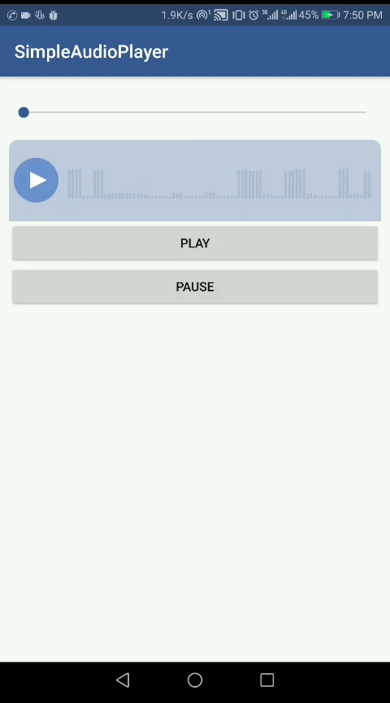

# AudioWaveSeekBar
A view for displaying and controlling audio file

</img>

# Gradle
```
dependencies {
    ...
    implementation 'com.rexprog.audiowaveseekbar:audiowaveseekbar:1.0.0'
}
```
# Usage
```
    <com.rexprog.audiowaveseekbar.AudioWaveSeekBar
        android:id="@+id/audioWaveSeekBar"
        android:layout_width="match_parent"
        android:layout_height="60dp" />
```

```
        waveSeekBar = findViewById(R.id.audioWaveSeekBar);
        waveSeekBar.setWaveform(UUID.randomUUID().toString().getBytes()); // random height
```
